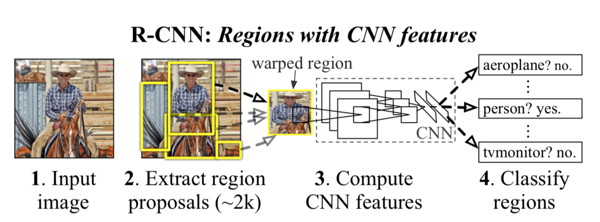
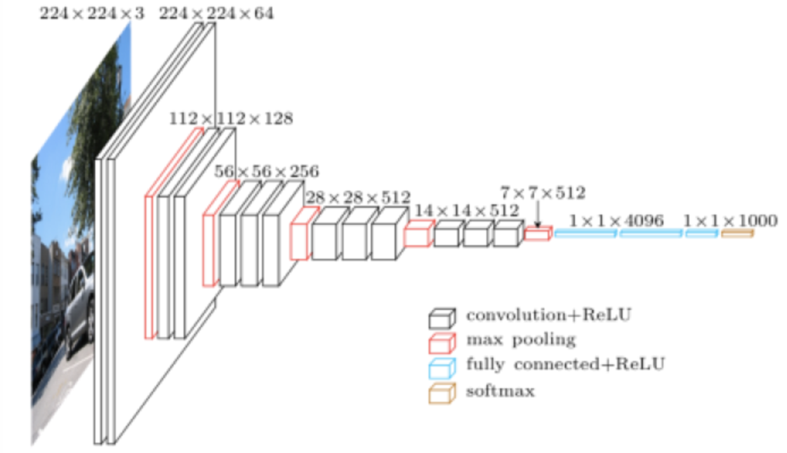
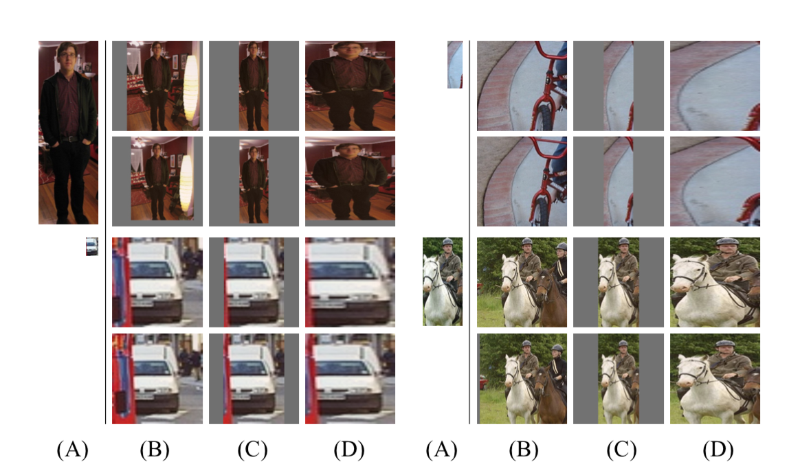
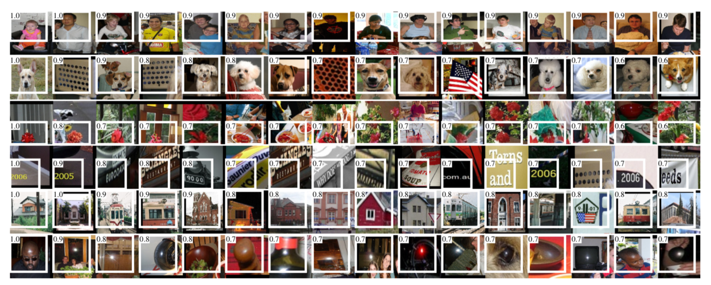
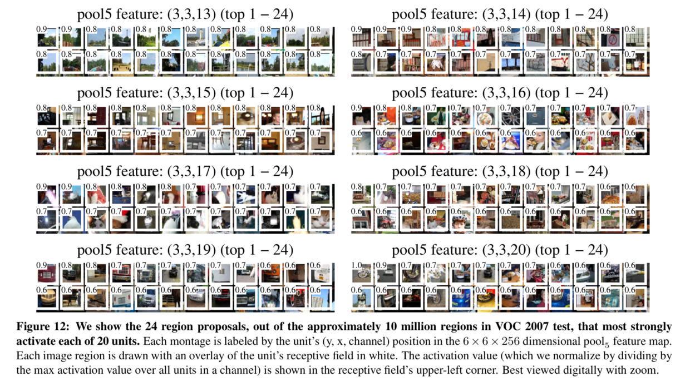

# 读论文系列·干货满满的RCNN

> 转载请注明作者：[梦里茶](https://github.com/ahangchen)

Object Detection，顾名思义就是从图像中检测出目标对象，具体而言是找到对象的位置，常见的数据集是PASCAL VOC系列。2010年-2012年，Object Detection进展缓慢，在DPM之后没有大的进展，直到CVPR2014，RBG大神（Ross Girshick）把当时爆火的CNN结合到Detection中，将PASCAL VOC上的准确率提高到53.7%，本文为你解读RBG的CVPR2014 paper：

> Rich feature hierarchies for accurate object detection and semantic segmentation

## Key insights

* 可以用CNN对图片局部区域做识别，从而判断这个局部是不是目标对象
* 在标记数据稀缺的情况下，可以用其他数据集预训练，再对模型进行fine tune

## RCNN Overview

1. 输入图片
2. 通过selective search给出2k个推荐区域（region proposal）

   > 检测问题的一个特点是，我们不仅需要知道一张图片中是否包含目标对象，而且需要知道目标对象所处位置，有几种方式，一种是回归图中检测框的位置\[38\]，但是准确率很低，一种是用滑动窗口的方法将图片切割成很多小块，再对小块做分析，但是对于CNN来说，每经过一层pooling，感受野就会变小，RCNN采用了一个五层卷积的结构，要求输入至少是195x195的尺寸，用滑窗不能保证这个输入大小。

> Selective search是一种比较好的数据筛选方式，首先对图像进行过分割切成很多很多小块，然后根据小块之间的颜色直方图、梯度直方图、面积和位置等基本特征，把相近的相邻对象进行拼接，从而选出画面中有一定语义的区域。关于Selective Search的更多信息可以查阅这篇论文：Recognition using Regions（CVPR2009）

1. 将每个推荐区域传入CNN提取特征
2. 为每个类训练一个SVM，用SVM判断推荐区域属于哪个类
3. 用NMS对同个类的region proposals进行合并
4. 用bounding box regressor对预测位置进行精细的修正，进一步提高精度

> 非极大值抑制（NMS）顾名思义就是抑制不是极大值的元素，搜索局部的极大值。这个局部代表的是一个邻域，邻域有两个参数可变，一是邻域的维数，二是邻域的大小。这里不讨论通用的NMS算法，而是用于在目标检测中用于提取分数最高的窗口的。例如在行人检测中，滑动窗口经提取特征，经分类器分类识别后，每个窗口都会得到一个分数。但是滑动窗口会导致很多窗口与其他窗口存在包含或者大部分交叉的情况。这时就需要用到NMS来选取那些邻域里分数最高（是行人的概率最大），并且抑制那些分数低的窗口。（转自知乎专栏：晓雷的机器学习笔记）

## 训练

从上面的Overview可以看出，需要训练的主要有两个部分，各个类共用的CNN和各个类单独的SVM。

### Network Structure

RCNN试了两种CNN框架，一种是Hinton他们在NIPS2012上发表的AlexNet：ImageNet Classification with Deep Convolutional Neural Networks

这是一个五层卷积+三层全连接的结构，输入是224x224的图片，输出是1000维one-hot的类别，

一种是VGG16\(Very Deep Convolu- tional Networks for Large-Scale Image Recognition\)

这是两个网络的检测结果：

VGG16精度更高一些，但是计算量比较大，实时性不如AlexNet，方便起见我们下面都以AlexNet为基础进行分析。

### Supervised Pretraining

首先用ImageNet预训练，输入图片，输出为这张图片包含的目标对象的类别，而不涉及具体位置，因为ImageNet中没有bounding box信息。训练到AlexNet能够在分类任务上达到Hinton他们的精度之后，开始用检测数据做Fine tune。

### Domain Specific Fine Tuning

直接用ImageNet预训练得到的CNN在PASCAL VOC上表现肯定是不如人意的，接下来，用PASCAL VOC 的检测数据进行fine tune。 因为VOC有20个分类，在ILSVR2013的检测任务中，最后有200个分类，而ImageNet有1000个分类，首先要把最后的全连接分类层替换成目标任务输出个数+1（加一个背景类）的全连接层。输入数据用的是Selective Search得到的Region Proposals对应的bounding box，

在这里的Fine tune中，需要判定Region Proposal属于哪种目标分类，在VOC的训练集中，有bounding box和对应的分类标注，RBG他们是检查每个Region Proposal与训练集中bounding box的重叠率，如果Region Proposal和bounding box重叠率大于阈值（经过实验，选了0.5）,则认为这个Region Proposal的分类为bounding box对应的分类，并且用这个对应的bounding box作为Fine tune的输入。

但是这些输入大小不一，需要调整到目标输入尺寸224x224，在附录A中讨论了很多的预处理方法，

A. 原图 B. 等比例缩放，空缺部分用原图填充 C. 等比例缩放，空缺部分填充bounding box均值 D. 不等比例缩放到224x224 实验结果表明B的效果最好，但实际上还有很多的预处理方法可以用，比如空缺部分用区域重复。

训练时，采用0.001的初始学习率（是上一步预训练的1/10），采用mini-batch SGD，每个batch有32个正样本（各种类混在一起），96个负样本进行训练。

### Object category classifiers

每个类对应一个Linear SVM二分类器\(恩，很简单的一个SVM，没有复杂的kernel\)，输入是CNN倒数第二层的输出，是一个长度为4096的向量，SVM根据这个特征向量和标签进行学习，调整权重，学习到特征向量中哪些变量对当前这个类的区分最为有效。

训练SVM的数据和Fine tuning训练CNN的数据有所不同，直接使用将PASCAL VOC训练集中的正样本，将与bounding box重叠率小于0.3的Region Proposals作为背景（负样本），这个重叠率也是调参比较出来的；另一方面，由于负样本极多，论文采用了hard mining技术筛选出了难分类负样本进行训练。不过这样的话，SVM和CNN的正负样本定义就不同了，SVM的正样本会少很多（那些重叠率大于0.5的bounding box就没用上了）。

> 附录B中解释，其实一开始RBG他们是用SVM的正负样本定义来Fine tune CNN的，发现效果很差。SVM可以在小样本上就达到比较好的效果，但CNN不行，所以需要用上更多的数据来Fine tune，重叠率大于0.5的Region Proposals的数据作为正样本，可以带来30倍的数据，但是加入这些不精准的数据的代价是，检测时位置不够准确了（因为位置有些偏差的样本也被当做了正样本）。
>
> 于是会有一个很自然的想法，如果有很多的精确数据，是不是可以直接用CNN加softmax输出21个分类，不用SVM做分类？RBG他们直接在这个分类方式上fine tune，发现这样做的准确率也很高（50.9%），但是不如用SVM做分类的结果（54.2%），一方面是因为正样本不够精确，另一方面是因为负样本没有经过hard mining，但至少证明，是有可能直接通过训练CNN来达到比较好的检测效果的，可以加快训练速度，并且也更加简洁优雅。

### Bounding-box regression

这部分是在附录C展开阐述的（CVPR篇幅限制）。首先，为每个类训练一个bounding box regressor，类似DPM中的bounding box regression，每个类的regressor可以为每个图输出一个响应图，代表图中各个部分对这个类的响应度。DPM中的Regressor则是用图像的几何特征（HOG）计算的；不同于DPM，RCNN-BB中这种响应度\(activation\)是用CNN来计算的，输入也有所不同，DPM输入是原图，输出是响应图（从而得到bbox的位置），RCNN-BB的Regressor输入是Region Proposals的位置和原图，输出是bounding box的位置。

定义一个region proposal的位置为$$P=(P_x, P_y, P_w, P_h)$$，x,y为region prosal的中心点，w,h为region proposal的宽高，对应的bounding box的位置为$$G=(G_x,G_y,G_w,G_h)$$，Regressor的训练目标就是学习一个P-&gt;G的映射，将这个映射拆解为四个部分：

$$\hat{G}_x=P_wd_x(P)+P_x$$

$$\hat{G}_y=P_hd_x(P)+P_x$$

$$\hat{G}_w=P_wexp(d_w(P))$$

$$\hat{G}_h=P_hexp(d_h(P))$$

其中，$$d_*(P)$$是四个线性函数，输入为P经过前面说的fine tune过的CNN后得到的pool5特征，输出为一个实数，即$$d_*(P) = w^T_*\phi_5(P)$$

训练就是解一个最优化问题，求出四个w向量，使得预测的G和真实的G相差最小，用差平方之和代表距离，化简后的形式为：

$$w_x = argmin_{\hat{w}_*} \sum_i^N(t_*^i-\hat{w}_*^T\phi_5(P^i))^2 + \lambda||\hat{w}_*||^2$$

其中，

$$t_x = (G_x - P_x)/P_w$$

$$t_y = (G_y - P_y)/P_h$$

$$t_w = log(G_w/P_w)$$

$$t_h = log(G_h/P_h)$$

跟前边的四个映射是对应的， 同时加上了$$\lambda||\hat{w}_*||^2$$，对w的l2正则约束，抑制过拟合

训练得到四个映射关系后，测试时用这四个映射就能够对预测的Region Proposals位置做精细的修正，提升检测框的位置准确率了。

> 至此，整个训练和测试过程就介绍完毕了。

### 玄学时间

在论文中还打开RCNN中卷积层分析它们的功能，在AlexNet的论文中，Hinton已经用可视化的方式为我们展示了第一层卷积描述的是对象的轮廓和颜色，但后面的层因为已经不能表示成图像，所以不能直接可视化，RBG的方法是，输入一张图片的各个区域，看pool5（最后一层卷积层的max pooling输出）中每个单元的响应度，将响应程度高的区域框出来：

pool5的feature map大小为6x6x256，图中每行的16张图代表一个unit响应度最高的16张图，将每张图响应度较高的区域用白色框框出来了，这里只挑了6个unit进行展示（所以只有6行）。一个unit是6x6x256的张量中的一个实数，这个数越大，意味着对输入的响应越高。

可以看到不同的unit有不同的分工，第一行的unit对person响应度比较高，第二行的unit对dog和dot array（点阵）的响应度比较高，可以从这个角度出发，用每个unit充当单独的一种object detector。

附录D中还有更多的可视化结果

之所以说是玄学是因为，虽然这种可视化一定程度上体现了CNN学习到的东西，但是仍然没有说明白为什么是这个单元学习到这种信息。

## Summary

RCNN第一次把CNN结合Region proposal用到了detection任务中，取得了很好的效果，在这篇论文里，还体现了很多视觉深度学习的流行技巧，比如Pretrain，Fine tune，传统方法与深度学习结合（分割+检测，CNN+SVM，Bounding box regression），可以说是相当值得一读的好paper了。

