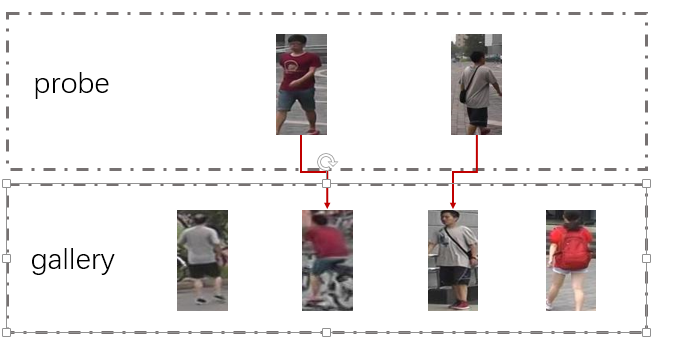
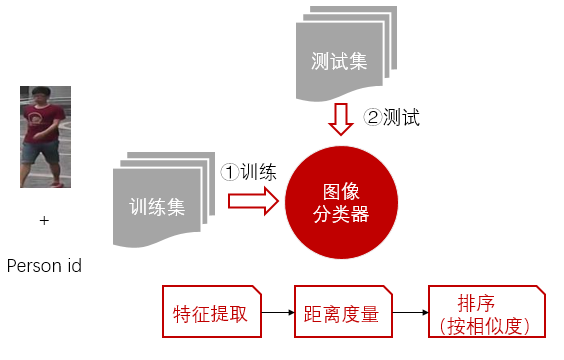
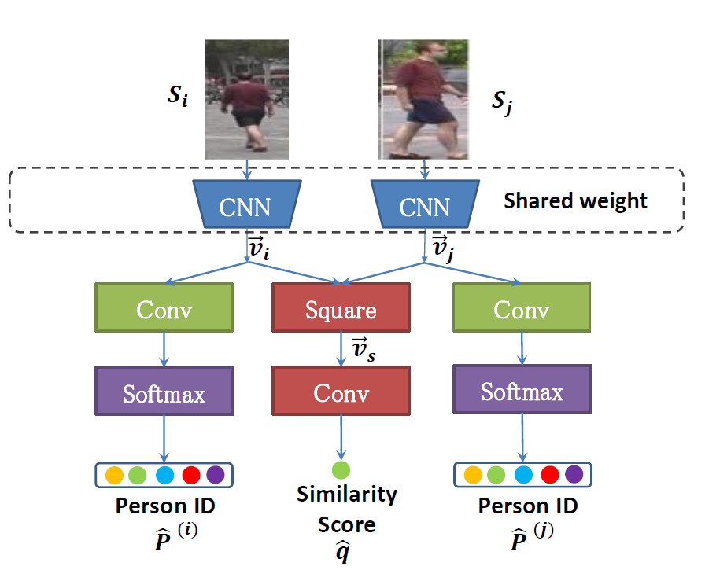
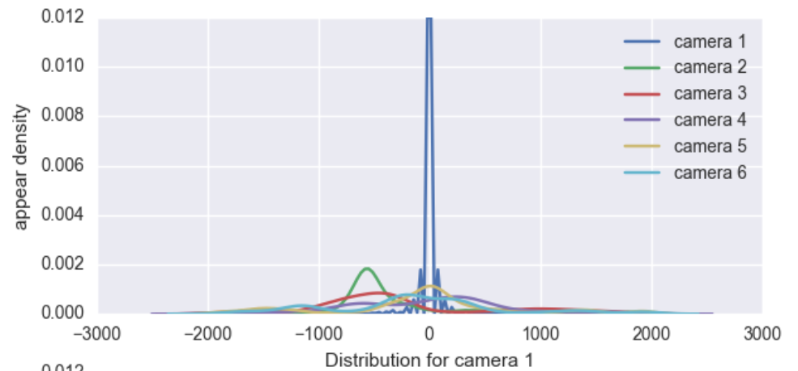
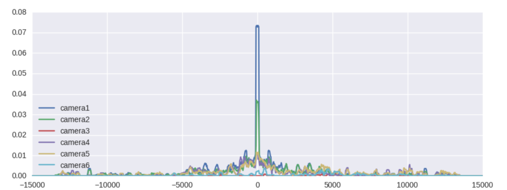
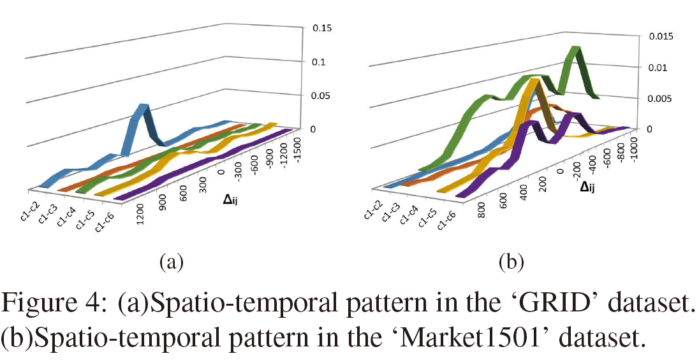
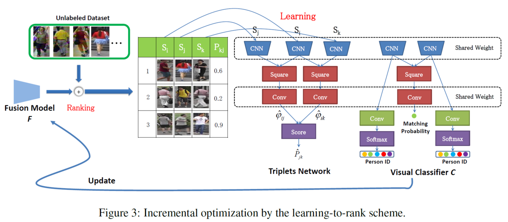
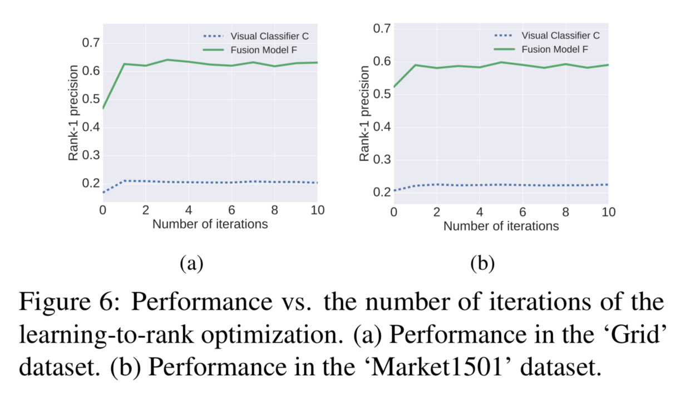

# CVPR2018:TFusion完全解读

## Citation

Please cite this paper in your publications if it helps your research:

```text
@article{
  title={Unsupervised Cross-dataset Person Re-identification by Transfer Learning of Spatial-Temporal Patterns},
  author={Jianming, Lv and Weihang, Chen and Qing, Li and Can, Yang},
  journal={CVPR},
  year={2018}
}
```

论文可以在[arxiv下载](https://arxiv.org/abs/1803.07293)，老板一作，本人二作，也是我们实验室第一篇CCF A类论文，这个方法我们称为TFusion。

> 转载请注明作者[梦里茶](https://github.com/ahangchen)

代码：[https://github.com/ahangchen/TFusion](https://github.com/ahangchen/TFusion)


* 解决的目标是跨数据集的Person Reid
* 属于无监督学习
* 方法是多模态数据融合 + 迁移学习
* 实验效果上，超越了所有无监督Person reid方法，逼近有监督方法，在部分数据集上甚至超越有监督方法

本文为你解读CVPR2018 TFusion

## Task

行人重识别\(Person Re-identification\)是一个图像检索问题，给定一组图片集\(probe\)，对于probe中的每张图片，从候选图片集（gallery）中找到最可能属于同一个行人的图片。


行人重识别数据集是由一系列监控摄像头拍摄得到，并用检测算法将行人抠出，做行人的匹配。在这些数据集中，人脸是十分模糊的，无法作为匹配特征，而且由于多个摄像头拍摄视角不同，同个人可能被拍到正面，侧面，背面，具有不同的视觉特征，因此是一个比较难的图像匹配问题。常用数据集有很多，可以在[这个网站](http://robustsystems.coe.neu.edu/sites/robustsystems.coe.neu.edu/files/systems/projectpages/reiddataset.html)查到。

## Related Work

行人重识别问题有以下几种常见的解决方案：

### 基于视觉的行人重识别

这类方法通常提取行人图像特征，对特征进行距离度量，从而判断是否是同一个人。

#### 有监督学习


这类方法通常需要提供行人图片和行人id标签（person1,person2等），训练模型，提取图像特征，根据两张图特征的距离大小（可以用余弦距离，欧氏距离之类的计算），为probe中的每张图和gallery中的每张图计算其相似度，根据相似度将gallery中的图片排序，排序越高越可能为同一个人。

这方面的论文代表有TOMM2017: A Discriminatively Learned CNN Embedding for Person Re-identification，我们采用的基础图像分类器就是基于这篇论文用Keras实现的，后面细讲。

#### 无监督学习

在CVPR2018之前，Person Reid领域正式发表的无监督工作只有CVPR2016的UMDL：Unsupervised Cross-Dataset Transfer Learning for Person Re-identification，基于字典学习方法，在多个源数据集上学习跨数据集不变性字典，迁移到目标数据集上。然而准确率依然很低。

### 结合摄像头拓扑的行人重识别

行人图片是摄像头拍到的，摄像头之间有一定的距离，行人的移动有一定的速度限制，因此行人在摄像头间的移动时间就会呈现出一定规律，比如，AB摄像头间有10米，人行走速度2m/s，如果AB摄像头在1s内捕捉到了两张图片，则这两张图片不可能是同一个人的，因此我们可以利用摄像头拓扑约束来提升行人重识别的准确率。

然而，这类方法往往有以下缺陷：

* 有些方法需要预先知道摄像头拓扑（AB摄像头之间的距离）
* 有些方法可以根据拍摄到的图像数据推断出摄像头拓扑，但是需要图像有标注（是否是同一个人）
* 即使推断出摄像头拓扑，与图像的融合结果依然很差

### 迁移学习

迁移学习现在是深度学习领域很常用的一个套路了，在源数据集上预训练，在目标数据集上微调，从而使得源数据集上的模型能够适应目标场景。这方面的论文代表有前面讲的UMDL，和[Deep transfer learning person re-identification](http://cweihang.cn/ml/reid/deep_transfer_learning_person_reid.html)，然而，目前的迁移学习大多需要标签，而无监督迁移学习效果又很差，仍然有很大提升空间。

更多关于Person Reid的内容可以看一下我在博客写的几篇[调研](http://cweihang.cn/ml/reid/)

## Motivation

* 现有的行人重识别数据集中是否包含时空信息？包含的话是否存在时空规律？
* 缺乏两个时空点是否属于同一行人这种标签时，如何挖掘时空信息，构建时空模型？
* 如何融合两个弱分类器？有监督的融合有boosting算法可以用，无监督呢？
* 在缺乏标签的条件下，如何进行有效的迁移学习？

对应有三个创新点

* 无监督的时空模型构建
* 基于贝叶斯推断的时空图像模型融合
* 基于Learning to Rank的迁移学习

接下来详细解析我们的方法。

## 时空模型

### 数据集中的时空规律

所谓时空模型，即一个摄像头网络中，行人在给定两个摄像头间迁移时间的分布。

我们看遍所有Reid数据集，发现有三个数据集有时空信息，Market1501, GRID, DukeMTMC-ReID，其中，DukeMTMC-ReID是2017年后半年才出来的，时间比较仓促在论文中就没有包含跟它相关的实验。Market1501是一个比较大的Person Reid数据集，GRID是一个比较小的Person Reid数据集，并且都有六个摄像头（GRID中虽然介绍了8个摄像头，实际上只有6个摄像头的数据）。

例如，Marke1501中一张图片的时空信息是写在图片名字中的：


0007\_c3s3\_077419\_03.jpg：

* 0007代表person id，
* c3代表是在3号摄像头拍到的，也就是空间信息，
* s3代表属于第3个时间序列（GRID和DukeMTMC中没有这个序列的信息，在Market1501中，不同序列的属于不同起始时间的视频，同一系列不同摄像头的视频起始时间相近）,
* 077419为帧号，也就是时间信息。

我想吐槽的是，其实时空信息是非常容易保存的，只要知道图片是在什么时候，哪台摄像机上拍摄，就能够将时空信息记录并有效利用起来，希望多模态数据融合得到更多重视之后，做数据集的人能够更加重视可保存的信息吧。

我们首先通过Market1501中的真实行人标签，计算训练集中所有`图片对`对应的`时空点对`对应的迁移时间，这里可视化了从摄像头1出发的行人，到达其他摄像头需要的时间的分布。


可以看到，到达不同目标摄像头的峰值位置不同，其中从摄像头1到摄像头1，意味着被单个摄像头拍到连续多帧，所以峰值集中在0附近，从摄像头1到摄像头2，峰值集中在-600附近，意味着大部分人是单向从摄像头2运动到摄像头1，等等，并且，说明这个数据集中存在显著可利用的时空规律。

### 无监督的时空模型构造

我们将迁移时间差命名为delta，这样说起来方便~~\(装逼\)~~一点。

如果我们能够统计一个数据集中的所有delta，给定一个新的delta（两个新的图片对应的两个时空点算出来的），我们能够用极大似然估计，用在这个delta前后一定范围\(比如100帧\)的delta的出现频率\(=目标范围delta数量/总的delta数量\)，作为新时间差出现的概率，也就是两个时空点是同一人产生的概率。

> 但是！问题是我们在目标场景上往往是没有行人标记数据的！

于是我们就_思考_，

* 我们能不能根据两个时空点对应的两张图是否属于同一个人，来决定两个时空点是否属于同一个人？
* 而两张图是否属于同一个人，其实是一个图像匹配的二分类问题，我们可以用一些视觉模型来做，
* 但是这种视觉模型往往是需要有标签训练的，无标签的视觉模型往往比较弱
* 视觉模型弱没关系！我们相信跟时空模型结合就能变成一个强大的分类器！要有信仰！
* 只要我们能无监督地把时空模型构造出来，结合弱的图像分类器，因为加了时空信息，一定能吊打其他无监督模型！

思路有了，实现就很自然了，

* 我们先在其他数据集上（于是我们就可以说这是一个跨数据集的任务了）预训练一个卷积神经网络，
* 然后用这个卷积神经网络去目标数据集上提特征，
* 用余弦距离算特征相似度
* 将相似度排在前十的当做同一个人
* 用这种“同一个人”的信息+极大似然估计构造时空模型

图像分类器上，我们这里用的是LiangZheng的Siamese网络，他们的源码是用MATLAB实现的，我用Keras[复现](https://github.com/ahangchen/rank-reid/blob/master/pretrain/pair_train.py#L139)了一把：


时空模型的极大似然估计可以看[这里](https://github.com/ahangchen/TrackViz/blob/simfus/train/st_estim.py#L30)

聪明的读者应该会注意到，这个图像分类器是在其他数据及上预训练的，由于特征空间中数据分布不同，这个图像分类器太弱了，对于目标数据集来说，前十里会有许多错的样本，导致构造出来的时空模型和真实的时空模型有偏差


可以看到，构造的模型跟真实的模型还是有些差别的，但是峰值位置还是差不多，一定程度上应该还能用，但我们还是希望构造的模型尽量接近真实模型的。

于是我们开始_思考_

* 导致模型出现偏差的因素是什么？是错误的样本对
* 如何去掉错误样本对的影响？我们能不能把错误的样本对分离出来？没有标签咋办？
* （灵光一闪）错误的样本不就跟我瞎选的差不多？那我是不是可以随机地选样本对，算一个随机的delta分布出来
* 将估算的delta分布去掉随机的delta分布，剩下的多出来的部分，就是由于正确的行人迁移产生的，不就得到真实的delta分布了？

于是我们可视化了一下随机的delta分布


可以发现，

* 确实与估计模型和真实模型不同
* 存在较多抖动

这种随机的时间差分布也呈现出一定的集中趋势，其实体现的是采样的时间差分布，如，在1号摄像头采的图片大多在某个时间段，2号摄像头也大多在这个时间段采，但3号摄像头的图片大多是在其他时间段采到的。

考虑到时间差的频率图有这么多的抖动，我们在计算某个区域的时间差时，加上了均值滤波，并且做了一定区域的截断，包括概率极小值重置为一个最小概率值，时间差极大值重置为一个最大时间差。

接下来，应该怎么把错误的模型从估计的模型滤掉呢？又怎么将时空模型和图像模型结合呢？

## 基于贝叶斯推断的模型融合

首先看时空模型和图像模型的融合， 我们有一个视觉相似度$$P_{v}$$，一个时空概率$$P_{st}$$，一个直观的想法是，联合评分可以是$$P_{v} * P_{st}$$，如果要再抑制随机的评分$$P_{random}$$，可以做个除法，就是$$P_{v} * P_{st} / P_{random}$$

这样一看，像不像条件概率公式？于是我们开始推导（大量公式预警）：

先看看我们手上的资源：现在我们有一个弱的图像分类器，可以为两张图片提取两个视觉特征$$v_{i}, v_{j}$$, 有两个时空点，空间特征为两个摄像头编号$$c_{i}, c_{j}$$，时间特征为两张图片拍摄的时间差$$∆_{ij}$$，假定两张图对应的person id分别为$$P_{i}, P_{j}$$，那么我们的目标就是求，在给定这些特征的条件下，两张图属于同一个人的概率

$$Pr(P_{i}=P_{j}|v_{i},v_{j},c_{i},c_{j},∆_{ij})$$（论文公式6）

由条件概率公式P\(A\|B\) = P\(B\|A\)\*P\(A\)/P\(B\)，可得

$$Pr(P_{i}=P_{j}|v_{i},v_{j},c_{i},c_{j},∆_{ij})$$ $$= Pr(v_{i},v_{j},c_{i},c_{j},∆_{ij}|P_{i}=P_{j}) *Pr(P_{i}=P_{j})/ Pr(v_{i},v_{j},c_{i},c_{j},∆_{ij})$$

由时空分布和图像分布的独立性假设（长得像的人运动规律不一定像），我们可以拆解第一项，得到 $$= Pr(v_{i},v_{j}|P_{i}=P_{j})*Pr(c_{i},c_{j},∆_{ij}|P_{i}=P_{j}) *Pr(P_{i}=P_{j})/ Pr(v_{i},v_{j},c_{i},c_{j},∆_{ij})$$

其中$$Pr(P_{i}=P_{j})$$是一个不好求的项，我们试着把它换掉，

先交换顺序（乘法交换律）

$$= Pr(v_{i},v_{j}|P_{i}=P_{j}) * Pr(P_{i}=P_{j})*Pr(c_{i},c_{j},∆_{ij}|P_{i}=P_{j}) / Pr(v_{i},v_{j},c_{i},c_{j},∆_{ij})$$

由条件概率公式$$P(A|B)*P(B) = P(B|A) * P(A)$$可得

$$= Pr(P_{i}=P_{j}|v_{i},v_{j}) * Pr(v_{i}=v_{j})*Pr(c_{i},c_{j},∆_{ij}|P_{i}=P_{j}) / Pr(v_{i},v_{j},c_{i},c_{j},∆_{ij})$$

可以看到

* $$Pr(P_{i}=P_{j}|v_{i},v_{j})$$可理解为两张图从视觉特征相似度上判定为同一人的概率
* $$Pr(c_{i},c_{j},∆_{ij}|P_{i}=P_{j})$$就是两个时空点是同一个人移动产生的概率

再次利用时空分布和图像分布的独立性假设，拆解分母

$$= Pr(P_{i}=P_{j}|v_{i},v_{j}) * Pr(v_{i}=v_{j})*Pr(c_{i},c_{j},∆_{ij}|P_{i}=P_{j}) / Pr(v_{i},v_{j}) * P(c_{i},c_{j},∆_{ij})$$

约掉$$Pr(v_{i}=v_{j})$$，

$$= Pr(P_{i}=P_{j}|v_{i},v_{j}) * Pr(c_{i},c_{j},∆_{ij}|P_{i}=P_{j}) /P(c_{i},c_{j},∆_{ij})$$

也就是

> = 视觉相似度\*同一人产生这种移动的概率/任意两个时空点组成这种移动的概率

这也就是论文公式\(7\)，也就是我们一开始的猜想：$$P_{v} * P_{st} / P_{random}$$

看着好像很接近我们手头掌握的资源了，但是，

* 我们并不知道理想的两张图的视觉相似度$$Pr(P_{i}=P_{j}|v_{i},v_{j})$$ ，只有我们的图像分类器判定的两张图的视觉相似度$$Pr(S_{i}=S_{j}|v_{i},v_{j})$$ ，
* 我们并不能计算同一人产生这种移动的真实概率$$Pr(c_{i},c_{j},∆_{ij}|P_{i}=P_{j})$$ ，我们只有依据视觉分类器估算的时空概率$$Pr(c_{i},c_{j},∆_{ij}|S_{i}=S_{j})$$ ，
* 我们倒是确实有数据集中任意两个时空点产生这种移动的概率$$P(c_{i},c_{j},∆_{ij})$$

于是我们想用$$Pr(c_{i},c_{j},∆_{ij}|S_{i}=S_{j}) ，P(c_{i},c_{j},∆_{ij})$$去近似，得到

$$= Pr(S_{i}=S_{j}|v_{i},v_{j}) * Pr(c_{i},c_{j},∆_{ij}|S_{i}=S_{j}) /P(c_{i},c_{j},∆_{ij})$$

看到这里其实就大致理解我们的融合原理了，实际上我们大部分实验也是用的这个近似公式算的。

实现上，先模拟两个时空模型，计算图像相似度，然后代入公式求融合评分，具体可以实现看[我GitHub](https://github.com/ahangchen/TrackViz/blob/simfus/train/st_filter.py)

> 但这个近似能不能做呢？我们来做一下误差分析（大量推导，不感兴趣可以跳到接下来出现的第二张图，不影响后面的理解，只是分析一波会更加严谨）。

实际上，误差是由图像分类器引入的，假设图像分类器判定两张图是同一个人的错判率为$$E_{p}$$，图像分类器判定两张图不是同一人的错判率为$$E_{n}$$，

则有，

$$E_{p} = Pr(P_{i}≠P_{j}|S_{i}=S_{j})$$（论文公式1）

$$E_{n} = Pr(P_{i}=P_{j}|S_{i}≠S_{j})$$（论文公式2）

则$$Pr(P_{i}=P_{j}|v_{i},v_{j})$$ 与 $$Pr(S_{i}=S_{j}|v_{i},v_{j})$$ 的关系可以表示为：

$$Pr(P_{i}=P_{j}|v_{i},v_{j})$$ $$= Pr(P_{i}=P_{j}|S_{i}=S_{j}) * Pr(S_{i}=S_{j}|v_{i},v_{j}) + Pr(P_{i}=P_{j}|S_{i}≠S_{j}) * Pr(S_{i}≠S_{j}|v_{i},v_{j})$$ $$= (1-E_{p}) * Pr(S_{i}=S_{j}|v_{i},v_{j}) + E_{n}* (1-Pr(S_{i}=S_{j}|v_{i},v_{j}) )$$ $$= (1-E_{p}-E_{n}) * Pr(S_{i}=S_{j}|v_{i},v_{j}) + E_{n}$$ （论文公式8）

推导，$$Pr(c_{i},c_{j},∆_{ij}|P_{i}=P_{j})$$ 和$$Pr(c_{i},c_{j},∆_{ij}|S_{i}=S_{j})$$ 的关系（这个没法像视觉相似度那样直接推导，因为因果关系不同）

$$Pr(c_{i},c_{j},∆_{ij}|S_{i}=S_{j})$$ $$= Pr(c_{i},c_{j},∆_{ij}|P_{i}=P_{j}) * (Pr(P_{i}=P_{j})|S_{i}=S_{j}) + Pr(c_{i},c_{j},∆_{ij}|P_{i}≠P_{j}) * (Pr(P_{i}=P_{j})|S_{i}≠S_{j})$$ $$= Pr(c_{i},c_{j},∆_{ij}|P_{i}=P_{j}) * (1- E_{p}) + Pr(c_{i},c_{j},∆_{ij}|P_{i}≠P_{j}) * E_{p}$$

同样可以得到

$$Pr(c_{i},c_{j},∆_{ij}|S_{i}≠S_{j})$$ $$= Pr(c_{i},c_{j},∆_{ij}|P_{i}=P_{j}) * E_{n} + Pr(c_{i},c_{j},∆_{ij}|P_{i}≠P_{j}) * (1 - E_{p})$$

联立上面两个式子解方程，消掉$$Pr(c_{i},c_{j},∆_{ij}|S_{i}≠S_{j})$$可以得到

$$Pr(c_{i},c_{j},∆_{ij}|P_{i}=P_{j})$$ $$= (1 - E_{p} - E_{n})^{-1}(1-E_{n}) * Pr(c_{i},c_{j},∆_{ij}|S_{i}=S_{j}) - E_{p} * Pr(c_{i},c_{j},∆_{ij}|S_{i}≠S_{j})$$ （论文公式5）

其中有个新概念$$Pr(c_{i},c_{j},∆_{ij}|S_{i}≠S_{j})$$ ，意味着图像分类器认为不是同一个人的时候，这种时空点出现的概率，实现上也不难，统计视觉相似度top10以后的点对应的时间差，作为反时空概率模型即可。

我们把两个近似（公式5和公式8）代进公式7，

可以得到

$$Pr(P_{i}=P_{j} | v_{i}, v_{j}, ∆_{ij}, c_{i}, c_{j})$$ $$= (M_{1} + E_{n}/(1 - E_{n} - E_{p}))((1-E_{n})M_{2} - E_{p}M_{3})/Pr(∆_{ij}, c_{i}, c_{j}))$$（论文公式9）

其中，

$$M_{1} = Pr(S_{i}=S_{j}|v_{i},v_{j})$$，视觉相似度

$$M_{2} = Pr(∆_{ij},c_{i},c_{j}|S_{i}=S_{j})$$，正时空概率模型

$$M_{3} = Pr(∆_{ij},c_{i},c_{j}|S_{i}≠S_{j})$$，反时空概率模型

分母$$Pr(∆_{ij}, c_{i}, c_{j}))$$为随机概率模型

以上四项都是可以从无标签目标数据集中结合图像分类器求解到的，并且，当En=Ep=0时（意味着图像分类器完全准确），这个公式可以退化为近似解：

$$Pr(S_{i}=S_{j}|v_{i},v_{j}) * Pr(c_{i},c_{j},∆_{ij}|S_{i}=S_{j}) /P(c_{i},c_{j},∆_{ij})$$

到这里，你是不是以为我们就可以用公式9算融合评分了？非也，公式9中，还有个问题：$$E_{p}，E_{n}$$是未知的！

如果想要正儿八经地算$$E_{p}，E_{n}$$，要求目标数据集有标签，然后我们用图像分类器先算一遍，数数哪些算错了，才能把$$E_{p}，E_{n}$$算出来。因此我们用两个常数α和β分别替代$$E_{p}，E_{n}$$，整个模型的近似就都集中在了这两个常数上。

在论文Table1,2,3,4,Fig6相关的实验中，α=β=0，并且，在Fig5中，我们设置了其他常数来检查模型对于这种近似的敏感性


可以看到，虽然α和β较大时，准确率会有所下降，但是仍然能保持一定的水准，当你看到纯图像分类器的准确率之后，还会发现融合模型的准确率一直高于纯图像分类器。

你可能注意到了，图中α+β都是小于1的，这是因为，只有当$$E_{p}+E_{n}<1$$且$$α+β<1$$时，融合模型的$$E_{p}+E_{n}$$才会小于图像模型的$$E_{p}+E_{n}$$，说人话就是，只有图像模型不是特别糟糕，且近似的参数也比较正常的时候，融合模型才会比单个的图像模型要准，融合才有意义。这个定理的具体的证明放到论文附录里了，有兴趣的可以邮件私信我拿附录去看，这里摆出来就太多了。

> 于是我们得到了一个由条件概率推断支撑的多模态数据融合方法，称为贝叶斯融合

看一眼融合得到的时空分布图：


再从数据上看一眼融合的模型有多强：

| 源数据集 | 目标数据集 | 纯 | 图像 | 结果 |  | 融合 | 时空 | 结果 |
| :---: | :---: | :---: | :---: | :---: | :---: | :---: | :---: | :---: |
|  |  | rank-1 | rank-5 | rank-10 |  | rank-1 | rank-5 | rank-10 |
| CUHK01 | GRID | 10.70 | 20.20 | 23.80 |  | 30.90 | 63.70 | 79.10 |
| VIPeR | GRID | 9.70 | 17.40 | 21.50 |  | 28.40 | 65.60 | 80.40 |
| Market1501 | GRID | 17.80 | 31.20 | 36.80 |  | 49.60 | 81.40 | 88.70 |
|  |  |  |  |  |  |  |  |  |
| GRID | Market1501 | 20.72 | 35.39 | 42.99 |  | 51.16 | 65.08 | 70.04 |
| VIPeR | Market1501 | 24.70 | 40.91 | 49.52 |  | 56.18 | 71.50 | 76.48 |
| CUHK01 | Market1501 | 29.39 | 45.46 | 52.55 |  | 56.53 | 70.22 | 74.64 |
|  |  |  |  |  |  |  |  |  |
| GRID | DukeMTMC | 9.74 | 18.31 | 22.53 |  | 20.20 | 27.42 | 28.82 |
| VIPeR | DukeMTMC | 18.80 | 32.22 | 39.67 |  | 43.99 | 56.15 | 60.41 |
| CUHK01 | DukeMTMC | 22.35 | 34.16 | 39.81 |  | 31.15 | 40.84 | 43.90 |

可以看到，

* 跨数据集直接迁移效果确实很差
* 融合之后的准确率Rank1准确率变成2-4倍

说明这种融合方式是确实行之有效的。

## 基于Learning to Rank的迁移学习

前面讲到图像分类器太弱了，虽然融合后效果挺好的（这个时候我们其实想着要不就这样投个NIPS算了），但是如果能提升图像分类器，融合的效果理论上会更好。而现在我们有了一个强大的融合分类器，我们能不能用这个融合分类器为目标数据集的图片打标签，反过来训练图像分类器呢？

一个常用的无监督学习套路就是，根据融合评分的高低，将图片对分为正样本对和负样本对（打伪标签），然后喂给图像分类器学习。


我们也尝试了这种做法，但是发现，数据集中负样本远远多于正样本，融合分类器分对的负样本是挺多的，但是分对的正样本超级少，分错的正样本很多，错样本太多，训练出来效果极差，用上一些hard ming的技巧也不行。

于是我们_思考_，

* 我们无法提供正确的01标签，分类器就只能学到许多错的01标签
* 我们是否可以提供一些软标签，让分类器去学习回归两个样本之间的评分，而不是直接学习二分类的标签？
* 这是一个图像检索问题，我们能不能用信息检索中的一些学习方法来完成这个任务？

于是自然而然地想到了Learning to Rank

### Ranking

* 问题定义：给定一个对象，寻找与其最相关的结果，按相关程度排序
* 常用方法：
  * Point-wise：每一个结果算一个绝对得分，然后按得分排序
  * Pair-wise：每两个结果算一下谁的得分高，然后按这个相对得分排序
  * List-wise：枚举所有排列情况，计算综合得分最高的一种作为排序结果

综合得分往往需要许多复杂的条件来计算，不一定适用于我们的场景，所以排除List-wise，Point-wise和Pair-wise都可以采用，得分可以直接用融合评分表示，Pair-wise可以用一组正序样本，一组逆序样本，计算两个得分，算相对得分来学习，有点Triplet loss的意味，于是在实验中采用了Pair-wise方法。

### Pair-wise Ranking

* 给定样本$$x_{i}$$，其排序得分为$$o_{i}$$，
  * 给定样本$$x_{j}$$，其排序得分为$$o_{j}$$，
* 定义$$o_{ij}=o_{i} - o_{j}$$，如果$$o_{ij}>0$$说明$$x_{i}$$的排名高于$$x_{j}$$，
* 将这个排名概率化，定义$$P_{ij} = e^{o_{ij}}/(1+e^{o_{ij}})$$，为$$x_{i}$$排名高于$$x_{j}$$的概率。
* 对于任何一个长度为n的排列，只要知道n-1个相邻item的概率$$P_{i,i+1}$$，就可以推断出来任何两个item的排序概率
* 例如，已知$$P_{ik}和P_{kj}$$，$$P_{ij} = P_{ik} * P_{kj} = e^{o_{ik}+o_{kj}}/(1 + e^{o_{ik}+o_{kj}})$$，其中$$o_{ik}=ln(P_{ik}/(1 - P_{ik}))$$

### RankNet: Pair-wise Learning to Rank

RankNet是Pair-wise Learning to Rank的一种方法，用一个神经网络去学习输入的两个样本（还有一个query样本）与其排序概率（上面定义的）的映射关系。

具体到我们这个问题里

* 给定查询图片A，给定待匹配图片B和C
* 用神经网络预测AB之间的相似度$$S_{ab}$$为B的绝对排序得分，计算AC之间的相似度$$S_{ac}$$为C的绝对排序得分

> 具体的神经网络用[Keras实现](https://github.com/ahangchen/rank-reid/blob/master/transfer/simple_rank_transfer.py)并可视化出来长这样：


> * 输入是三张图片，分别用Resnet52提取特征并flatten
> * flatten之后写一个Lambda层+全连接层算特征向量带权重的几何距离，得到score1和score2
> * 用score1和score2和真实分数算交叉熵Loss（下面讲）

* 则B排序高于C的概率为：

$$P_{bc}= e^{o_{bc}}/(1+ e^{o_{bc}}) = e^{S_{ab}- S_{ac}} / (1 + e^{S_{ab}- S_{ac}})$$

* 用预测概率P\_{bc}去拟合真实的排序概率，回归损失用预测概率和真实概率的交叉熵表达

$$C(o_{bc}) = -P'_{bc}ln P_{bc} - (1-P'_{bc})ln (1 - P_{bc})$$

网络实现超级简单，主要麻烦在样本三元组构造

### Transfer Learning to rank

> 整个Learning to rank过程如图


我们用融合分类器为目标数据集中的图片对评分，构造三元组输入RankNet，其中S_{i}是查询图，S_{j}是在与S_{i}融合相似度top1 - top25中抽取的图片，S_{k}是在与S\_{i}融合相似度top25 - top50中抽取的图片，喂给RankNet学习，使得resnet52部分卷积层能充分学习到目标场景上的视觉特征。

### Learning to Rank效果

| 源数据集 | 目标数据集 | 纯 | 图像 | 结果 |  | 融合 | 时空 | 结果 |
| :---: | :---: | :---: | :---: | :---: | :---: | :---: | :---: | :---: |
|  |  | rank-1 | rank-5 | rank-10 |  | rank-1 | rank-5 | rank-10 |
| CUHK01 | GRID | 17.40 | 33.90 | 41.10 |  | 50.90 | 78.60 | 88.30 |
| VIPeR | GRID | 18.50 | 31.40 | 40.50 |  | 52.70 | 81.70 | 89.20 |
| Market1501 | GRID | 22.30 | 38.10 | 47.20 |  | 60.40 | 87.30 | 93.40 |
|  |  |  |  |  |  |  |  |  |
| GRID | Market1501 | 22.38 | 39.25 | 48.07 |  | 58.22 | 72.33 | 76.84 |
| VIPeR | Market1501 | 25.23 | 41.98 | 50.33 |  | 59.17 | 73.49 | 78.62 |
| CUHK01 | Market1501 | 30.58 | 47.09 | 54.60 |  | 60.75 | 74.44 | 79.25 |
|  |  |  |  |  |  |  |  |  |
| GRID | DukeMTMC | 13.06 | 23.29 | 29.04 |  | 29.94 | 43.00 | 47.80 |
| VIPeR | DukeMTMC | 19.39 | 33.21 | 39.77 |  | 42.64 | 56.51 | 59.78 |
| CUHK01 | DukeMTMC | 27.96 | 42.01 | 48.97 |  | 45.47 | 60.82 | 66.16 |

对比Learning to Rank前的效果，准确率都提升了，GRID数据集上提升尤为明显。

#### 对比SOA有监督方法

一方面，我们将上面的跨数据集无监督算法应用在GRID和Market1501两个数据集上，与当前最好的方法进行对比，另一方面，我们还测试了有监督版本的效果，有监督即源数据集与目标数据集一致，如GRID预训练-&gt;GRID融合时空，效果如下：

* GRID

| Method | Rank 1 |
| :---: | :---: |
| JLML | 37.5 |
| TFusion无监督 | 60.4 |
| TFusion有监督 | 64.1 |

由于在这个数据集上时空规律十分明显（正确时间差都集中在一个很小的范围内），可以过滤掉大量错误分类结果，所以准确率甚至碾压了全部有监督方法。

* Market1501

| Method | Rank 1 |
| :---: | :---: |
| S-CNN | 65.88 |
| DLCE | 79.5 |
| SVDNet | 82.3 |
| JLML | 88.8 |
| TFusion无监督 | 60.75 |
| TFusion有监督 | 73.13 |

在Market1501这个数据集上，无监督的方法逼近2016年的有监督方法（我们的图像分类器只是一个ResNet52\)，有监督的方法超越2016年的有监督方法，虽然比不上2017年的有监督方法，但是如果结合其他更好的图像分类器，应该能有更好的效果。

#### 对比SOA无监督方法

我们向UMDL的作者要到了代码，并复现了如下几组跨数据集迁移实验

| Method | Source | Target | Rank1 |
| :---: | :---: | :---: | :---: |
| UMDL | Market1501 | GRID | 3.77 |
| UMDL | CUHK01 | GRID | 3.58 |
| UMDL | VIPeR | GRID | 3.97 |
| UMDL | GRID | Market1501 | 30.46 |
| UMDL | CUHK01 | Market1501 | 29.69 |
| UMDL | VIPeR | Market1501 | 30.34 |
|  |  |  |  |
| TFusion | Market1501 | GRID | 60.4 |
| TFusion | CUHK01 | GRID | 50.9 |
| TFusion | VIPeR | GRID | 52.7 |
| TFusion | GRID | Market1501 | 58.22 |
| TFusion | CUHK01 | Market1501 | 59.17 |
| TFusion | VIPeR | Market1501 | 60.75 |

其中，UMDL迁移到Market1501的结果与悉尼科技大学hehefan与LiangZheng[复现](https://github.com/hehefan/Unsupervised-Person-Re-identification-Clustering-and-Fine-tuning/tree/master/dataset/Duke)出来的效果差不多，所以我们的复现是靠谱的。

可以看到，无监督的TFusion全面碾压UMDL。

> 更多详细实验结果可以到论文中细看。

#### 多次迭代迁移学习


回顾一下整个架构，我们用图像分类器估算时空模型，得到融合模型，用融合模型反过来提升图像分类器模型，图像分类器又能继续增强融合模型，形成一个`闭环`，理论上这个闭环循环多次，能让图像分类器无限逼近融合分类器，从而得到一个目标场景中也很强大的图像分类器，因此我们做了多次迭代的尝试：


在从目前的实验效果看，第一次迁移学习提升比较大，后面提升就比较小了，这个现象往好了说可以是收敛快，但往坏了说，没有出现图像分类器接近融合分类器的现象，所以这里边应该还有东西可挖。

## 后记


调研，可视化，找思路，找数据集，做实验，Debug，调参，写论文，九个月写一篇CVPR，这也是我们实验室第一篇CCF A类论文，算是来之不易的开山之作了。现在我们在Person Reid领域继续探索，正在搭建一个基于树莓派的摄像头网络，构造自己的数据集，并在这个基础上开展行人检测，多模态数据融合，轻量级深度模型，分布式协同终端，视频哈希，图像索引等一系列研究，欢迎follow我的[Github](https://github.com/ahangchen)，也欢迎持续关注我们[实验室的博客](http://blog.so-link.org)

看了人家这么久，还不给我[Github](https://github.com/ahangchen/TFusion)点star！

