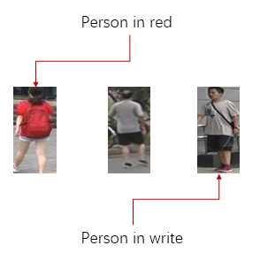
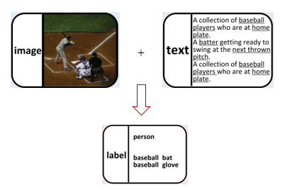
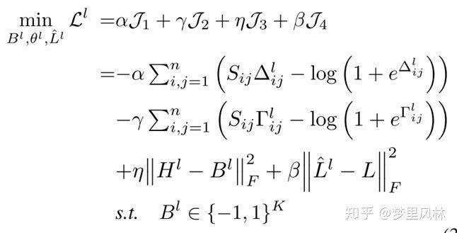
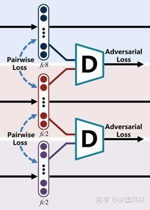
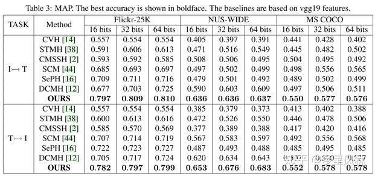
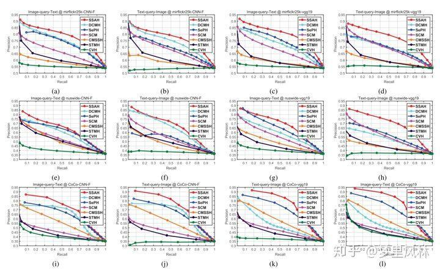
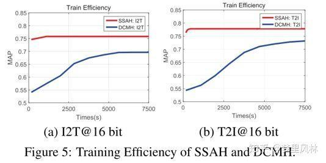
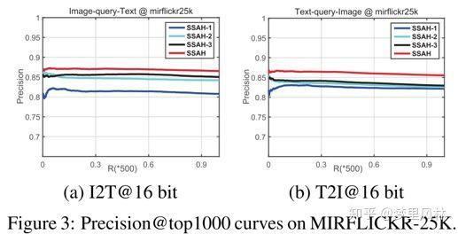

# CVPR2018: SSAH

> 转载请注明作者：[梦里茶](https://github.com/ahangchen)

这是腾讯AI Lab与西电合作的一篇CVPR2018的paper，在多模态检索任务中加入对抗网络组件，为跨模态对象生成更好的语义特征，从而提高了跨模态检索的效果。

## 问题描述

跨模态检索：

* 利用一种模态的数据去检索另一种模态中的数据，比如文字搜图片

* 寻找多种模态的数据对应的关键字

* 常用的数据集：MSCOCO, NUS-WIDE, MIRFLICKR-25K

如果我们在检索的时候再去做特征提取，检索速度会很慢，因此通常需要预先将特征提取出来，根据相似度建立索引，从而加快检索速度，为了节省存储空间，并加快计算效率，通常会要求特征尽量短，并且是二进制表示，这样的特征我们称为Hash。

## 常用方法

我们要根据多模态的内容生成一个hash，希望不同模态的同个对象hash尽量相近，不同对象的hash尽量不同。由于跨模态的内容具有语义上的联系，通常的做法是将不同模态的内容映射到公共的语义空间，已经有很多这方面的工作，有监督/无监督的，Shallow的手工特征/Deep特征。得到特征之后，可以用sign操作将连续的feature向量变成离散值，从而得到更轻量的特征。

## SSAH

这篇论文提出了一个结合对抗学习的深度神经网络：

* 利用深度提取图像和文本特征，转为hash（I/T-&gt;F-&gt;L+H-&gt;B）
* 利用标签生成特征，再转为hash，并希望特征能够还原回label（（L-&gt;F-&gt;L+H-&gt;B）
* 有监督地最小化不同模态特征和hash的差异
* 加入能够区分不同来源的特征的判别器进行对抗训练，进一步减小不同模态特征的差异

接下来具体讲其中几个部分：

## Self supervised semantic Generation\(L-&gt;F-&gt;L+H-&gt;B\)

* 输入：某个图文对应的label，每个对象会对应多个label，one hot成01向量
* 经过四层神经网络（L-&gt;4096-&gt;512-&gt;N）
* 输出长度为N的向量，N=K+c，K为哈希码长度，c为label的类别个数
* 训练目标：让生成的hash保留语义上的相关性，并能还原回原来的label

训练目标由这个Loss约束完成：

首先解释一下符号（以下数学符号用LaTeX格式显示，简书不支持公式编辑，更好的阅读体验请查看[cweihang.io](http://cweihang.io)），

* $$H^l$$ 是根据label生成的hash，
* $$B^l$$是由hash执行sign操作得到的二进制码
* $$\hat{L}$$ 是由特征还原回来的label
* $$L$$ 是原本的label
* $$\Delta_{ij}^l=\frac{1}{2}(F_i^l)^\top(F_j^l)$$ ，即样本i和样本j的label生成的特征的余弦相似度
* $$\Gamma_{ij}^l=\frac{1}{2}(H_i^l)^\top(H_j^l)$$，即样本i和样本j的label生成的特征余弦相似度
* $$S_{ij}$$ 表示样本i和j是否包含至少一个相同的label，
  * 包含为1，表示样本i和j在语义上相似
  * 不包含为0，表示样本i和j在语义上不相似
* 对于 $$\mathcal{J}_1$$ ,

$$-\sum_{i,j=1}^{n}{S_{ij}\Delta_{ij}^{l}-log(1+e^{\Delta_{ij}^l})}$$

$$= -\sum_{i,j=1}^{n}{log(\frac{e^{S_{ij}\Delta_{ij}^{l}}}{1+e^{\Delta_{ij}^l}})}$$

$$= -\sum_{i,j=1}^{n}{log(\frac{e^{\Delta_{ij}^{l}}}{1+e^{\Delta_{ij}^l}})} if S_{ij}=1$$

$$= -\sum_{i,j=1}^{n}{log(\frac{1}{1+e^{\Delta_{ij}^l}})} if S_{ij}=0$$

$$= \sum_{i,j=1}^{n}-{S_{ij}log(\frac{e^{\Delta_{ij}^{l}}}{1+e^{\Delta_{ij}^l}})-(1-S_{ij})log(1-\frac{e^{\Delta_{ij}^{l}}}{1+e^{\Delta_{ij}^l}})}$$

所以，实际上这个loss和交叉熵loss是等效的

即$$S_{ij}=1$$时，

$$min -\sum_{i,j=1}^{n}{log(\frac{e^{\Delta_{ij}^{l}}}{1+e^{\Delta_{ij}^l}})}=max\sum_{i,j=1}^{n}{log(\frac{1}{1+e^{-\Delta_{ij}^l}})}=max \Delta_{ij}^l$$

最大化两个向量的余弦相似度

$$S_{ij}=0$$ 时，

$$min -\sum_{i,j=1}^{n}{log(\frac{1}{1+e^{\Delta_{ij}^l}})}=max\sum_{i,j=1}^{n}{log(\frac{1}{1+e^{\Delta_{ij}^l}})}=min\Delta_{ij}^l$$

最小化两个向量的余弦相似度

* 对于$$\mathcal{J}_2$$ 同理，从而约束了相似的label具有相似的hash
* 对于 $$\mathcal{J}_3$$, 使 $$H^l$$ 和 $$B^l$$ 尽可能接近，从而使得Hash向量中的元素尽量接近-1,1，减少了 H -&gt; B 时的损失
* 对于 $$\mathcal{J}_4$$ , 使得还原的标签与原来的标签尽可能相同

> 这个部分跟自编码器很像，是自监督的过程，由label生成特征，再由特征还原回label

## Feature Learning\(I/T-&gt;F-&gt;L+H-&gt;B\)

* 输入：图像/文本，
* 经过神经网络提取特征（图像和文本的网络不同）
* 输出长度为N的向量，N=K+c，K为哈希码长度，c为label的类别个数
* 训练目标：
  * 在特征中保留语义信息，因此希望预测label与真实label相近
  * hash尽量接近binary code
  * 让特征提取得到的feature和hash与Semantic Generation得到的特征和hash尽量相同，
    * 因此监督信号做feature learning的时候还对提取feature和生成feature的相似性做约束，
    * 对提取hash和生成hash的相似性做约束

其中，图像的特征提取网络作者试用了CNN-F和VGG16（VGG16更优），文本特征提取则是一个新的多尺度融合模型：

* 输入：文本，转为一个词袋向量，由于词袋向量非常稀疏，需要转化为一个相对稠密的向量
* 网络：T-&gt;Multi-scale Fusion-&gt;4096-&gt;512-&gt;N
* 输出长度为N的向量，N=K+c，K为哈希码长度，c为label的类别个数
* Multi-scale Fusion：
  * 5个average pooling layer\(1x1,2x2,3x3,5x5,10x10\)+1个1x1conv

训练Loss与前面的Semantic Generation很像

但又与之前的模型不同，这里的监督信号有标签和标签生成的特征，而之前的监督信号就是输入本身。

其中

* $$\Delta_{ij}^l=\frac{1}{2}(F_i^{l})^\top(F_j^{v,t})$$，即样本i的标签label生成的特征和样本j的输入（图/文）提取的特征的余弦相似度，目标是使提取的特征和生成的特征尽量相近
* $$\Gamma_{ij}^l=\frac{1}{2}(H_i^l)^\top(H_j^{v,t})$$，即样本i的标签label生成的hash和样本j的输入（图/文）提取的hash的余弦相似度，目标是使提取的hash和生成的hash尽量相近

## Adversarial learning

* Motivation:不同模态提取的特征会有不同的分布，希望相同语义的对象在不同模态里的特征表达尽量接近
* Solution:加入判别器D，希望D能区分特征是来自Feature Learning还是Semantic Generation，D越强大，越能区分两种特征，要欺骗D，就迫使Feature Learning和Semantic Generation得到的特征尽量相近

* 判别器D的网络结构：F-&gt;4096-&gt;4096-&gt;1
* 每个样本\(图+文+label\)产生3个特征 $$(𝑥_𝑖^𝑣,𝑥_𝑖^𝑡,𝑥_𝑖^𝑙)$$
* 输入：图/文特征+生成特征 $$(𝑥_𝑖^𝑣, 𝑥_𝑖^𝑙 )$$ 或$$(𝑥_𝑖^𝑡,𝑥_𝑖^𝑙)$$
* 输出： $$(𝑦_𝑖^𝑣, 𝑦_𝑖^𝑙 )$$ 或 $$(𝑦_𝑖^𝑡, 𝑦_𝑖^𝑙 )$$ ，即输入向量是否来自生成特征
* 监督信号： $$𝑦_𝑖^𝑣$$ 或 $$𝑦_𝑖^𝑡=0$$，$$𝑦_𝑖^𝑙=1$$
* 判别器的损失函数：

即最小化判别器的预测误差

## Training

* 于是我们有了特征生成Loss:

  $$\mathcal{L}_{gen}=\mathcal{L}^v+\mathcal{L}^t+\mathcal{L}^l$$

图像特征提取loss+文本特征提取loss+标签生成loss

* 以及对抗loss $$\mathcal{L}_{adv}=\mathcal{L}^v_{adv}+\mathcal{L}^t_{adv}$$
* 我们的优化目标是： $$(B,\theta^{v,t,l})=argmin_{B,\theta^{v,t,l}}\mathcal{L}_{gen}(B,\theta^{v,t,l})-\mathcal{L}_{adv}(\hat{\theta}_{adv})$$

在最优的判别器参数 $$\hat{\theta}_{adv}$$ 下，最小化特征的生成Loss

以及

$$\theta_{adv}=argmax_{\theta_{adv}} L_{gen}(\hat{B}, \hat{\theta}^{v,t,l})-L_{adv}(\theta_{adv})$$

在最优生成器参数 $$\hat{B}, \hat{\theta}^{v,t,l}$$下，最小化判别器的识别误差 $$L_{adv}$$

* 具体实现上，分为四步迭代进行优化：
  * Label自监督生成特征
  * 图像分类器feature learning
  * 文本分类器feature learning
  * 判别器训练

于是SSAH的工作机制就梳理完毕了

## 方法评估

生成的Hash效果是否足够好，通常由Hamming Ranking和Hash Lookup来评估，在论文中，作者还对模型本身做了Training efficiency，Sensitivity analysis，Ablation study的实验评估。

* Hamming Ranking
  * 按照哈希码海明距离进行Ranking，计算mAP

> 可以看到使用VGG作为图像基础网络时，SSAH准确率领先其他方法很多。

* Hash Lookup
  * 海明距离小于某个值认为是正样本，这个值称为Hamming Radius，改变Radius可以改变Precision-Recall的值，于是可以得到P-R曲线，P-R曲线与坐标轴围成的面积越大，说明效果越好

> SSAH的PR曲线基本都是在其他模型的曲线之上

* 对Ranking的结果计算TopN的命中率（不过这个文中好像没讲）
* Training efficiency
  * 达到相同的效果所需训练时间

> 相对于另一种深度学习方法DCMH，SSAH只要比较短的时间就能得到比较好的效果

* Sensitivity analysis
  * 超参数改变时的结果变化

> 可以看到，超参数变化时，准确率依然能维持在比较高的水平

* Ablation study
  * 去除不同组件对效果的影响

> 其中， SSAH-1: remove LabNet SSAH-2: TxtNet改成三层全连接 SSAH-3: 去掉对抗网络 可以看到在I2T任务中，标签生成网络是很重要的，在T2I任务中对抗网络的效果更明显。

## Summary

SSAH中最妙的两点是，用Label生成特征和哈希来监督feature learning，加入对抗学习来拉近不同模态特征的相似性，模型的思路足够清晰，容易复现，有很多值得学习的东西。

